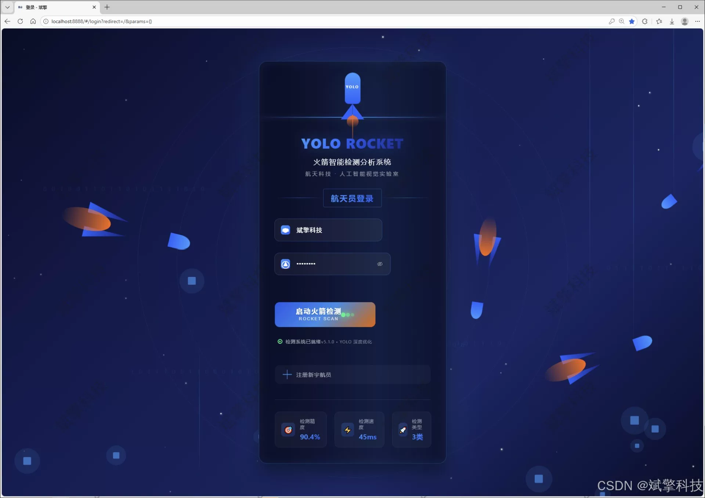
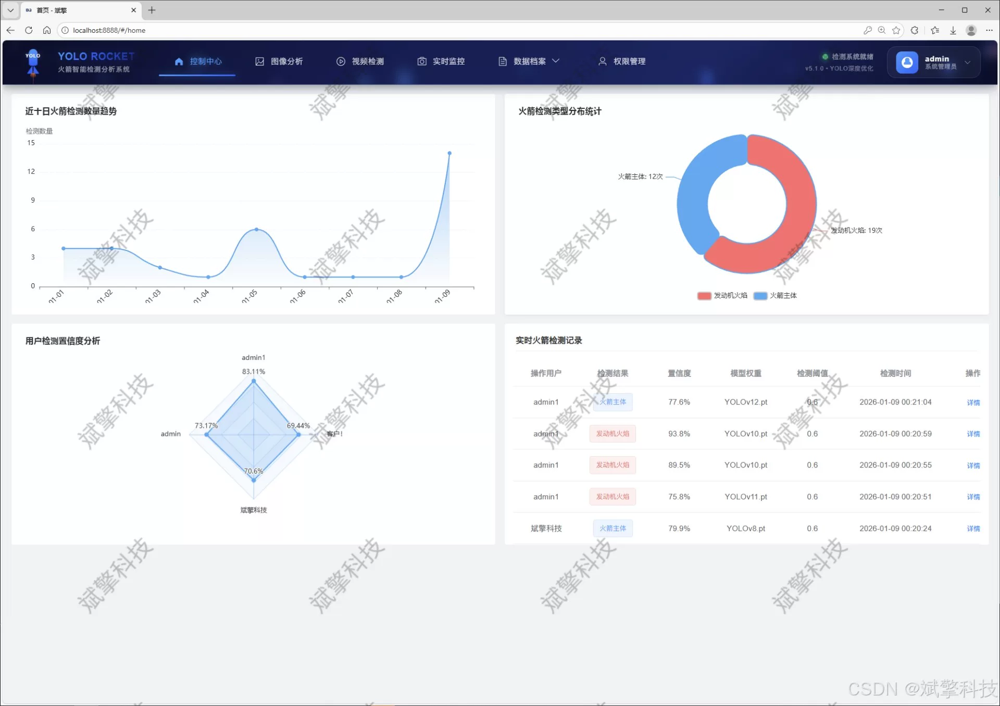
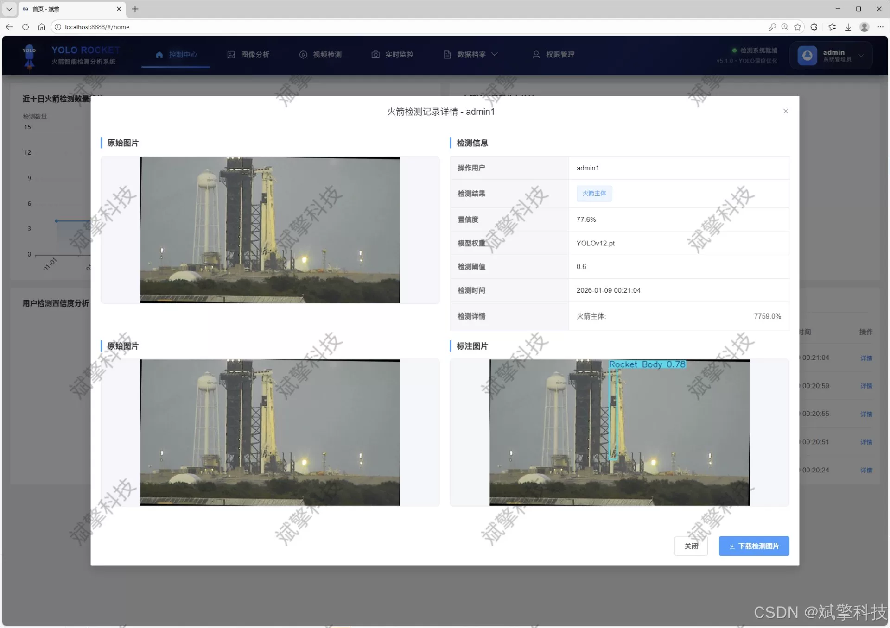
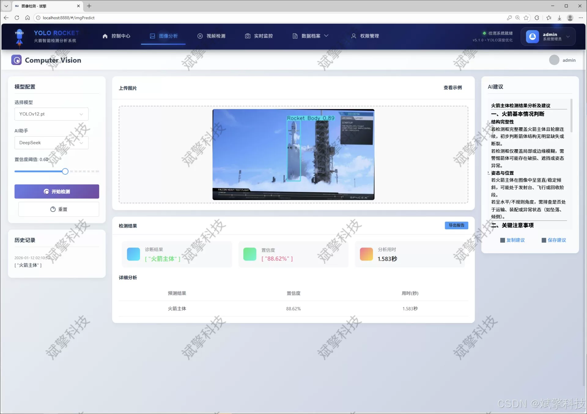
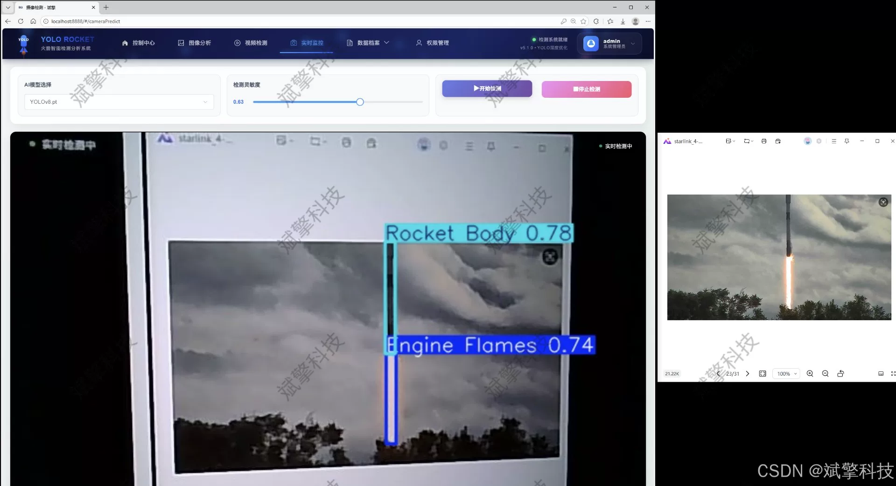
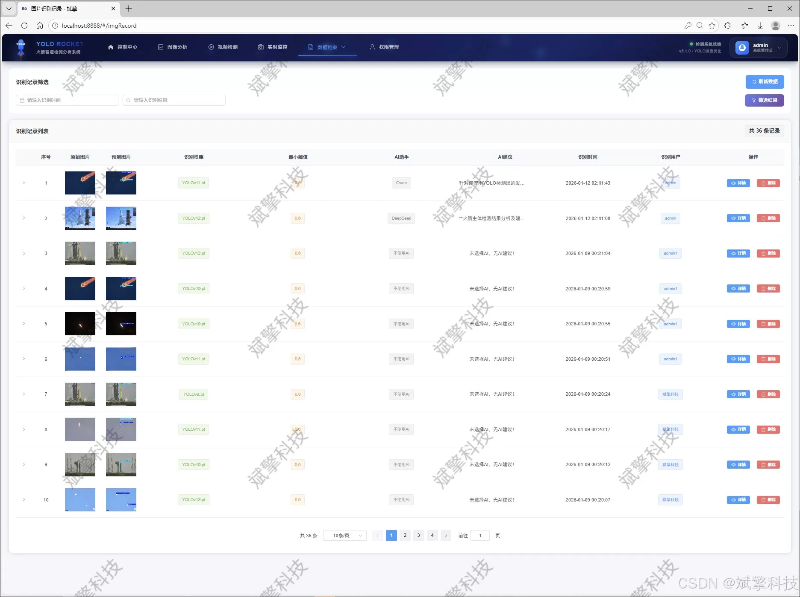
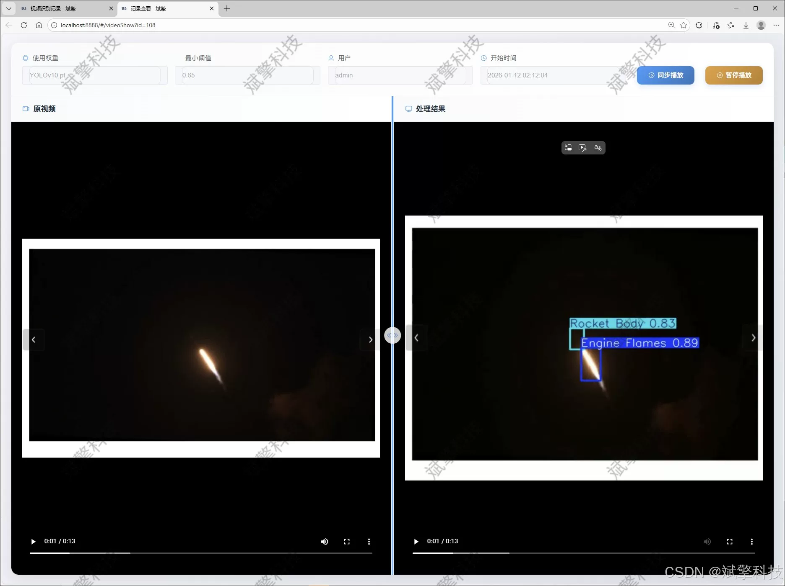
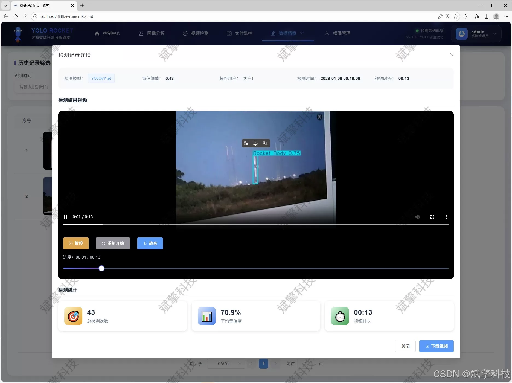
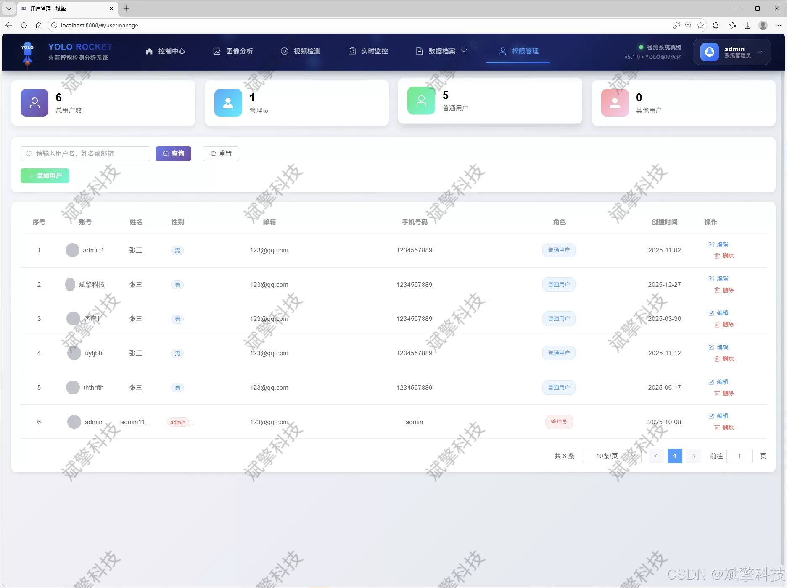

# YOLO Rocket Detection System

## Body

The YOLO Rocket Detection System is based on the YOLO deep learning and the large models of Qianwen and DeepSeek. The system includes the intelligent analysis of DeepSeek, a web interface, a separation between frontend and backend, YOLO data, and YOLOv8/YOLOv10/YOLOv11/YOLOv12.

With the rapid development of aerospace technology and the increasing frequency of commercial space activities, real-time, automated visual inspection and safety monitoring of rocket launches, flight, and in-orbit status have become key technical requirements in aerospace control, space situation perception, and mission assurance. Traditional inspection methods are limited by their low efficiency, reliance on manual labor, and difficulty in handling complex environments. To address this challenge, this project has designed and implemented an intelligent rocket detection and analysis system that integrates cutting-edge deep learning object detection technology with modern Web application architecture.

The core of this system utilizes four versions of the YOLO series with outstanding performance - YOLOv8, YOLOv10, YOLOv11, and YOLOv12 as detection engines to build a dynamically switchable, powerful target detection back-end. The frontend interaction interface is built based on SpringBoot, adopting a separation of the frontend and backend model to ensure high maintainability and scalability of the system. The system has the capability to detect rocket components (such as engine flames and payload) in images, videos, and real-time camera streams, and the detection results are persistently stored in MySQL databases for both users and the system. Notably, the system innovatively integrates the intelligent analysis function of DeepSeek large language model, which can perform semantic interpretation and deep insights on detection results, significantly enhancing the level of intelligence of the system. Additionally, the system provides complete user management, personal center, data visualization dashboard, and multimodal detection record management modules, forming a comprehensive, user-friendly enterprise application.

Functional module

✅ User Login and Registration: Supports password detection, saves to MySQL database.

✅ Supports four YOLO model switches, YOLOv8, YOLOv10, YOLOv11, YOLOv12.

✅ Information Visualization, Data Visualization.

✅ Image detection supports AI analysis functions, deepseek and Qianwen.

✅ Supports image detection, video detection, and real-time camera detection. The results are saved to a MySQL database.

✅ Picture recognition record management, video recognition record management and camera recognition record management.

✅ User Management Module, administrators can add, delete, modify, and query users.

✅ Personal center, can modify their own information, password name profile picture and so on.

There is no Lunwen writing service, nor any Lunwen.

## Images

## Payment

Here is a pay link on Stripe ( https://buy.stripe.com/3cs8yP7sY87d0vu9AB ). Please contact me lonlonago@foxmail.com after funding $89, and I will send you a complete data files , thank you!

